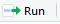

# Module I {#m1}

## First Steps

### Brief History

**R** is a language and environment for statistical programming that runs on various *NIX platforms, Windows and MacOS ([R-project.org](https://www.r-project.org)), and can be downloaded and distributed freely according to the General Public License (GPL).

The origin of the name **R** goes back to the **S** language, developed by John Chambers between 1975 and 76 at Bell Labs (former AT&T and current Lucent Technologies) – the same place where important innovations in computing originated, such as the UNIX operating system, the C programming language, transistors, among others.

In contrast to the commercial implementation of the S language – **S-PLUS**, Ross Ihaka and Robert Gentleman, professors from the Department of Statistics at Auckland - New Zealand, created R as a free and open-source alternative to the S language, in 1995. The name R itself comes from a play on the S language and the initials of the authors' names, Ross and Robert.

```{r born, fig.cap='Birthplace of R indicated with the `leaflet` package. Click on the blue pin', echo=FALSE}
### leaflet
#install.packages("leaflet")
library(leaflet)

# ex1:
m <- leaflet()
m <- addTiles(m)
m <- addMarkers(m, lng=174.768, lat=-36.852, popup="Where R was born!!")
m
```

****

### Installing **R**

Installing the R environment is easy to do on any operating system. On Windows, the steps are:

* 1 Access the website https://www.r-project.org/.
* 2 Click on download R or CRAN mirror.
* 3 Choose the repository (Comprehensive R Archive Network - CRAN) of your preference.
* 4 Click on Download R for Windows.
* 5 Click on base.
* 6 Download the installation executable by clicking on Download R X.X.X for Windows.
* 7 Run the downloaded file to install the software.

The default R window on Windows is quite simple. You can see it's divided into a larger window, called R GUI (R Graphical User Interface); and an R Console window. In this last window, when starting R, there's a description about the version used and some tips about the language. The `>` sign indicates the command line or prompt, which is where you type the commands to be run by the interpreter.


Here, it's worth making a distinction between the R language and some other programming languages: the R language is an interpreted language, that is, code execution occurs together with code analysis, as if it were _on-demand_. You type the code, give the execution command and immediately the interpreter gathers the commands, translates them to machine language (or low-level language) and transfers them to the processor for execution. Another example of an interpreted language would be Python.

In compiled languages, code analysis occurs in only one phase – compilation – when data is analyzed and source code is transformed into target code. The target code usually stays separate, in an executable file, which will be executed at a later time.

### Installing **RStudio**

Considering that R's original graphical interface is quite modest, there are several Integrated Development Environments (IDEs) that gather various tools to support programming and data analysis, with the goal of making users' lives easier. The most used IDE for the R language is RStudio.

See below steps to install RStudio on Windows:

* 1. Access the website https://www.rstudio.com/.
* 2. Click on DOWNLOAD.
* 3. Choose the FREE version and click on DOWNLOAD RStudio for Windows.

As you can see, RStudio's graphical interface is more "friendly" than R's _default_. The window is divided into three parts: one for _Console_, another for _Environment, History and Connections_ and another for _Files, Plots, Packages, Help and Viewer_. Other tabs can be added to the _Environment, History and Connections_ panel, depending on the type of work you're developing in R, such as the _Presentations_ tab when producing slides or the _Build_ tab when building and testing a package. The names in general are self-explanatory, but we'll talk more about them in the next modules.


****

### Installing **RTools** on Windows

Later on, we'll see how to install packages in R, which are nothing more than modules that can be added to your standard R installation. It happens that some of these modules have parts written in other languages, such as C++ and Fortran, which are compiled languages. By _default_, Windows doesn't come with compilers that can perform this task, unlike Linux and Mac. To work around this problem on Windows, we install **RTools**.

The Windows RTools application, also developed by the R Foundation, contains compilers and other tools necessary to install R packages that require compilation.

Installation is quite simple:

* Access https://cran.r-project.org/bin/windows/Rtools/
* Download the recommended executable, usually marked in green with the observation _recommended_;
* Run the application keeping the default options suggested during installation.

### Basic Functionalities of R and RStudio

#### R as a Calculator

The most basic way to use R is as a calculator. Basic arithmetic operations are performed with the following operators in R:

Operator | Operation
---------|---------
+        | addition
-        | subtraction
*        | multiplication
/        | division
^ or **  | exponentiation
x%%y     | modulo remainder
x%/%y    | integer quotient

Let's see some examples, typing in our console, right next to `>`, the following operations:

```{r}
2+1
4-2
2*3
3/3
3^2
3**2
5%%2
5%/%2
```

Notice that next to all answers, `[1]` appeared. The _brackets_ and the number _1_ inside indicate that in that line is the first element of the resulting object. This happens because R, whenever possible, works in a vectorized way. The value inside `[ ]` indicates the position within the answer vector of the number right after it (result). Since in each operation, the answer is unique, all values were located in the first position of our answer _vector_.

This will be very useful when you want, for example, to apply a mathematical operation or any other transformation to all entries in a column in a table and print the result in the console. In the _output_, R will break the result into some lines and these numbers in brackets will help us identify which position in the answer vector the first number of each line in the output printed in the console belongs to.

Try for example:

```{r}
1:100 * 2
```

In our example, R chose to break the multiplication of 100 numbers into groups of 17 numbers in the first 4 lines and a group of 15 values in the last. In the first line of our _output_, **2** is the element at position 1 (`[1]`) of the answer vector; in the second line, the number **36** is the element that refers to position 18 (`[18]`) of the answer vector and so on, until the last line that starts at element at position 86.

##### Prioritization and Hierarchy of Operations

Just like in MS Excel, parentheses will also be very useful for performing both arithmetic operations and comparisons and sequential execution of functions in R. With them, we can indicate the "priority" or order in which calculations/computations should be performed. Try the example below:

```{r}
((1007+1)/8)^2
```

Note that the operation is done from the inside out. First the interpreter executes `(1007+1)`, then divides this result by 8 (`/8`), to only then square everything (`^2`).

Without parentheses, the result would be quite different:

```{r}
1007+1/8^2
```

#### Logical Operators

You can also perform logical comparisons in R. Below are some of the logical operators that will be important in the first modules of the course. Others will be presented in the remaining modules:

Operator | Operation
---------|---------
>        | greater than
>=       | greater than or equal to
<        | less than
<=       | less than or equal to
==       | equal to
!=       | different from
x&&y     | x AND y
x\|\|y   | x OR y

Let's see some examples:

```{r}
2 > 1
1009 >= 1009

3 < 0.7
3 <= 3.0001

7 == 5
4353.789 == 4353.7891

8 != 13
4353.789 != 4353.7891

2 == 2 && 7 != 5
(2 == 2) && (7 != 5)

(2 == 3) || (7 <= 5)
4353.789 != 4353.7891 || 7 >= 0.7
```

Note that the answers are, in these examples, always a logical vector: `TRUE` or `FALSE`. Later on, we'll see the other types of vectors existing in R.

#### Saving your code in a script

In RStudio, you can add a small panel, which will make your work even easier. This is the _source pane_, a panel where you can create scripts to store multiple lines of code, so you can execute them all at once or line-by-line. If you want to save the calculations and logical comparisons you did earlier in a file so you can execute them later, you can do it through a script. In the script window, you can keep a trail of all commands used.

This is important because it optimizes the use of R by allowing running the same code for different files and different occasions, instead of having to redo all the programming every time our input data changes.
You can open several script windows, side by side, and navigate between them, as you do with browser tabs. In this course, we'll do all classes and exercises using script files.

To add the script window (_source pane_), just create a new file by clicking on , just below _File_, and then on . Our RStudio window should look like the following figure.


Let's add all the lines of code we executed earlier to our newly created script.


**TIP:** You can insert comments in your scripts as a way to document the steps of your work for future reference. In R, comments are included with the `#` character.

To save the script file, just press `Ctrl+S` or click on the single diskette in the menu bar. This file will be saved with extension _.R_, indicating it's a file with R language code.

**TIP:** We suggest you create and save one or more scripts for each class/section. This will help you organize your material and recover important concepts and examples during and after the course.

You can execute all lines of a script or choose to execute only a few lines or specific parts of this code. Select the part you want to execute and press `Ctrl+Enter`. You'll see, in the console (window below the script), your code being executed. An alternative to `Ctrl+Enter` is to select the part or line(s) and click on .

Most of the time, our code can take considerable time to be executed completely. To know if the interpreter is still busy executing your code, just look at the right corner of the _Console_ panel. If you see the symbol , the interpreter is still busy executing the last sequence of commands. The `">"` symbol will also not appear free in the console. You can try to stop execution by clicking on the _stop_ icon. However, it won't always be possible to interrupt it.

Try generating a normal distribution with 100 million entries:

```{r, eval=FALSE}
rnorm(1:100000000)
```

**TIP:** It can also happen that you look at the console and don't see the `>` symbol, without the *stop* icon appearing in the right corner of the panel. This usually happens when we forget to close some parenthesis, brace or bracket opened at the beginning of a code line. Do a test:

```{r, eval=FALSE}
((1007+1)/8^2
```

The console will be waiting for you to complete the code. You have two options: add the missing parenthesis (if possible) directly in the console, or press `Esc`, fix the code and execute it again.

#### _Environment_ Tab

All objects that are created in your R/RStudio session will be automatically stored in what we call the _Global Environment_, represented by the _Environment_ tab in RStudio.


Note that so far, our _Environment_ is empty. This is because we haven't "saved" any objects or results from the operations we performed earlier.

##### Object Assignment in R

To create an object in R, whether to store a specific value or the result of an operation, we use R's characteristic assignment sign `<-`, i.e. `a <- b` (read _a receives the value of b_). You can also use the reverse direction: `b -> a` (_a receives the value of b_), or even the equals sign `=`. These alternatives are less conventional. We suggest using `a <- b` so as not to confuse object creation with passing parameters in function arguments later on.

To create an object/variable **x** that contains the value **2**, execute:

```{r}
# x receives 2
x <- 2

# to see the value of x:
x
```

**TIP:** The shortcut for the assignment operator `<-` is `Alt+-`.

Note now that our _Environment_ tab is no longer empty:


Now let's save the results of some arithmetic operations and logical comparisons:

```{r}
out1 <- 789/34.5

out2 <- 3^2

out3 <- out1 > out2
```

Let's see how our _Environment_ looks with the new objects created:


R is quite liberal regarding its object naming policy. The prohibitions are only the following:

* a name cannot start with a digit, e.g.: `1out <- 2`;
* a name cannot contain only digits, e.g.: `01 <- 2`;
* a name cannot contain special characters, **except** `.` or `_`, e.g.: `out#01 <- 2`
* a name cannot be identical to a word used as a _token_ of the R language, e.g.: `TRUE <- 2`; `for <- 2`, etc.

**TIP:** The R language is _case sensitive_, that is, it distinguishes between uppercase and lowercase letters in a name. Therefore `Object_Name != object_name`!

#### Saving Environment objects

What if you want to save these objects created in your R session, to continue working on them later? It's possible to do it and it's simple.

To save all objects from your Environment, click on `Session` and `Save Workspace As...` in RStudio. A file with extension `.RData` will be saved with the name and path you specify.

An alternative would also be:

```{r, eval=FALSE}
save.image("C:\\path_to_preferred_folder\\my_workspace.RData")

# or

save.image("C:/path_to_preferred_folder/my_workspace.RData")
```

**TIP:** The backslash `\` has a special function in R, it functions as an escape character, which we'll see more in depth in future sessions. Therefore, for a backslash to stop having its special function, we need to "escape it" with another backslash. That's why we use two slashes in Windows addresses. One way to work around this is to use forward slashes, as in Linux. Even on Windows, R will know you're specifying a Windows path.

To load the saved file in future sessions, you again have two alternatives. The first is to click on `Session` and `Load Workspace...` in RStudio. The second is:

```{r, eval=FALSE}
load("C:\\path_to_preferred_folder\\my_workspace.RData")
```

If you want to save specific elements and not the entire environment, you can do it as follows:

```{r, eval=FALSE}
save(out1, out2, file="C:\\path_to_preferred_folder\\my_objects.RData")
```

To load these objects, you can also use the `load()` function.

**TIP:** To save and load a single element, such as a dataset (table) that was worked on but should still be loaded in a new session, you can use the `saveRDS()` and `readRDS()` functions. This is a more optimized format for saving large objects.

### R Language Structure

**R** can be considered a functional programming language, since most procedures and routines are performed through functions that receive some arguments as _input_, perform some actions on these arguments and return an output. Roughly speaking, function usage happens as follows:

```{r, eval=FALSE}
function_name(argument1 = value1, argument2 = value2, ...)
```

Although the arithmetic and logical operators seen earlier don't fit the functional structure described above, they end up operating internally as functions.

As you'll see later on, any user can create a function in R and not only use those made available by the language's default distribution.

**TIP:** We don't always need to use the `argument_name=value` format inside functions, because R is smart enough to match arguments by the position they're passed (`function_name(value1, value2)`) or even by the initial letters of the informed argument.

Let's see some examples of functions that perform mathematical operations and that come _factory-installed_ in _base R_ (R's basic distribution):

**TIP:** RStudio has the functionality of autocompleting the words you type with objects created during your R session or already existing in memory. When typing the functions below, test by typing the first two letters of each function and pressing `TAB`.

```{r}
# square root
sqrt(81)

# combining with operation prioritization
sqrt((3*3)^2)

## product
prod(2,2) # 2x2

prod(2,3,5,7,8) # 2x3x5x7x8

## logarithm
# log of 3 in base e
log(3) # natural log

# log of 3 in base 10
log(3,10)

# log3 in base 10
log10(3)

# abs = modulus, |3 - 9|
abs(3-9)

# factorial
# 4 factorial
factorial(4)
```

#### Packages in R {#pkg}

One of the reasons for the great success of the R language is due to the fact that any user can develop a "suite" containing various functions to perform one or several tasks. This set or suite of functions can be made available in the form of a package, which other users can install and also benefit from. After meeting a series of demanding requirements, these packages are usually made available on the [Comprehensive R Archive Network (CRAN)](https://cran.r-project.org).

CRAN has a quite serious package review policy. For an R package to be part of the CRAN repository, it must meet a series of requirements and be approved in several tests focused essentially on the following factors: user safety; error-free functioning on at least two operating systems; dense documentation (including bibliographic citations) about the package's functionalities.

All this makes packages made available on CRAN quite reliable, thus becoming the official source for package distribution of the language.

If you want to know the number of packages available on CRAN today, execute:

```{r, eval=FALSE}
dim(available.packages(contrib.url(getOption("repos")), filters=list()))[1]
```

In March of 2020 there were more than 15 thousand packages available on CRAN for the most diverse purposes. To see types of packages which exist in the repository, a visit to CRAN's [_Task Views_](https://cran.r-project.org/web/views/) is recommended. There are packages for Econometrics, Regional Economic Analysis, Statistics, Clustering, Clinical Trials, Time Series, Optimization, Data Processing, Machine Learning and many others.

#### Installing packages

To install packages available on CRAN, use the `install.packages("package_name")` function, passing the desired package name in quotes as a function argument.

Let's test this functionality by installing the `ggplot2` package, which is a package you'll probably use a lot in your analyses:

```{r, eval=FALSE}
install.packages("ggplot2")
```

If the package was correctly installed, you should see something similar to the following message in the console:

```{sh, eval=FALSE}
package 'ggplot2' successfully unpacked and MD5 sums checked

The downloaded binary packages are in
	C:\Users\...\...\...\...\...\downloaded_packages
>
```

Don't be alarmed if other packages were also installed. This is very common, since some packages may resort to functions present in other libraries.

To load or attach the package to your R session, so you can use the functions available in it, we use the `library(package_name)` or `require(package_name)` function. In this case, the package name can come with or without quotes.

```{r, eval=FALSE}
library(ggplot2)
```

If you don't want to load a package completely in your R session, because you'll only use a specific function, instead of `library()`, you can use the format `package_name::function_name(parameter)`.

#### Other package sources

It's worth noting that the basic installed version of R, which we call `base R`, already comes with some packages installed, such as the `stats`, `MASS`, `foreign`, `graphics`, `base` itself, among others. To list all packages installed on your machine, execute:

```{r, eval=FALSE}
installed.packages()
```

Although CRAN is the official R package repository, it's important to mention the existence of other important sources for obtaining packages as well.

The first of alternative sources is [**Bioconductor**](https://www.bioconductor.org/), which is an _open source_ software development project related to analysis and understanding of genomic data generated in laboratory experiments related to molecular biology. It's therefore an important package repository for those working with _Bioinformatics_ or _Biostatistics_.

The second source would be [**Github**](https://www.github.com) which is a system for code management and versioning. Anyone can create a github account and start sharing their code, which can be accessed and modified/improved (with the original author's consent). In R's case, packages usually have a _stable_ version on CRAN and a _development_ version on Github, where authors and other collaborators are working on improving and resolving package _bugs_. Once the GitHub version is stable and ready for release, the author can send it to CRAN.

Access the repository of the **emstreeR** package on Github: https://www.github.com/allanvc/emstreeR.

You can install R packages from their versions on Github. This is relatively common and occurs when a new functionality you want to test was implemented only in the package's development version and isn't yet available on CRAN. To install packages from their versions on Github, you need another package first, `devtools`.

Let's install the development version of the `emstreeR` package:

```{r, eval=FALSE}
install.packages("devtools") # if you don't have it installed on your machine

# alternative 1
devtools::install_github(repo="allanvc/emstreeR")

# or
# alternative 2
library(devtools)
install_github(repo="allanvc/emstreeR")
```

Note that we passed the repository path in the `repo` argument.

### How to get help

This is perhaps the most important part of all the material. Knowing **how** and **where** to seek help can mean spending just a few minutes instead of hours or even days solving a problem involving data analysis and programming. Throughout this course and when using R in a work activity, you'll encounter various questions involving programming logic, data analysis, or even trying to know if there's already an implemented package that performs the task you need.

#### R's _Help_

The first place to seek help about something related to R is usually within R or RStudio itself. As we mentioned in section \@ref(#pkg), CRAN's policy requires packages to be very well documented. And this helps users and developers a lot. In addition to `base R` documentation and other packages that already accompany the standard installation, when installing a new package, this new library's documentation becomes part of R's _help_ installed on your machine. So, when we want to understand a function, that is, know its input parameters, what it does and what it returns, it's recommended to use R's own _help_.

In the lower right panel, you'll find a series of tabs, the 3rd of which is the tab that displays help material. You can do searches using the search field in the tab itself, or through commands inserted in the console.


An example: imagine you'd like to know if R has any function that calculates the logarithm (base $e$) of a number. For this, we have the `help.search()` function, which receives as a parameter ("in quotes") the topic you want to search about. All R help is in English; therefore, if you want to find something related to logarithm, you should execute the `help.search("logarithm")` or `??logarithm` command.

Let's see:

```{r, eval=FALSE}
# alternative 1
help.search("logarithm")

# or
# alternative 2
??logarithm
```

In RStudio's _Help_ tab the results of packages and respective functions containing the words you searched for will appear. In this case, therefore, we have the `log()` function from the base package to calculate logarithms. See:


If you already know exactly the name of the R function or object you want to get help about, you can also use `help("word")` or `?word`.

```{r, eval=FALSE}
# alternative 1
help("log")

# or
# alternative 2
?log
```


Generally, the most important topics in help files are _Description_, _Usage_, _Arguments_ and _Examples_. The first shows what the function does, the second how the function should be used, the third what arguments it receives and, in the fourth, you find examples of how it works. _Value_ can also be interesting, as it informs what type of object the function returns.

##### _Vignettes_

Later on, we'll see how to install new packages in R. These packages are like additional modules that allow the user to perform more operations and activities in the language. Many of these packages bring with them, in addition to basic documentation, true tutorials on how to use the package itself or specific functions of these packages. They're much more detailed than the simple _Help_ documentation of the package or a function. While some don't provide any _vignette_, others can bring more than one _vignette_. If you want to check, use:

```{r, eval=FALSE}
vignette("package_name")
```

#### Help via Internet

R is well known for its extremely active community. Often, when analyzing data, problems arise that cannot be solved only with the language's internal documentation. In these cases, it's necessary to resort to the experience of other users who have experienced the problem and can give tips on how to reach the desired point. In R's 20 years, it will be difficult not to find someone who experienced the same problem as you. At this point the internet is our best friend and it's no shame to look for help there. From the most inexperienced language users to the most talented R developers, everyone, without exception, ends up resorting to the internet as a valuable source of information and help. There are free books, blogs with excellent tutorials, forums and Q&A (questions and answers) sites.

In the latter case, there's no way not to mention [StackOverflow](http://www.stackoverflow.com), which is a questions and answers website specialized in programming in general. The R community on StackOverflow is extremely active and one of the largest on the site. There you'll find beginner, intermediate, advanced users, package developers and even people who work on updating the language and RStudio. There's a Portuguese version and an English one. Resort to the English version of the site, as it's obviously much more active.

Before posting a question there, do a search with the terms you want, for example: _"How do I make a scatter plot in R?"_. If you type this in the site's search or even on Google, in the first results you'll already have the necessary answers from StackOverflow to make a _scatterplot_ in R, in at least 3 different ways, using different packages.

See an example of a question and answer on StackOverflow:


***

***

## R Language Object Structure

Understanding the structure of creating and manipulating objects in R will be essential to boost your learning speed in the remaining course sessions. Good use of more practical topics depends a lot on a solid understanding of R language objects.

Everything (or almost everything) in R is objects. The most important are:

* **Vectors**: are a kind of one-dimensional array. They consist of a sequence of values that can be: numeric, characters or logical expressions (like TRUE or FALSE). It's emphasized that vector entries can be of only one single type.

Example:

```{r,echo=FALSE}
v1 <- head(iris[,1]); v1
```

* **Matrices**: are multidimensional arrays with a collection of vectors in rows or columns, with all vectors in the collection having the same type and size.

Example:

```{r, echo=FALSE}
m2 <- matrix(rep(c("R", "UNF"), 5), ncol=2); m2
```

* **Dataframes**: in terms of appearance, they're practically identical to matrices, but with the possibility of having a collection of vectors (columns) of different types (e.g.: a numeric vector and another character vector). Because of this characteristic, it's the main object used to store data tables in R.

Example:

```{r,echo=FALSE}
df1 <- head(iris, 10); df1
```

* **Lists**: is the broadest type of object, which can gather collections of dataframes, vectors and/or matrices, or even all of them. A list characteristic is that, since objects inside it don't need to be of the same type, there's also no need for them to be of the same size. This is often very helpful in data manipulation.

Example:

```{r,echo=FALSE}
v2 <- c("R", "UNF", "2020")
m1 <- matrix(runif(2^2), 2)

my_list <- list(v2, head(iris, 5), m1)
my_list
```

* **Functions**: are a set of procedures that receive zero, one or more parameters as _input_, perform a calculation or procedure and return a result to the user. As you can see, even functions are considered objects in R.

Example:

```{r, echo=FALSE}
log
```

In this section, we'll study more in depth the creation and manipulation of vectors and Dataframes, which we judge to be the most important objects for this course. Function creation will be the object of study in a future module.

### Vectors

#### How to create a vector

In R there are 3 types of vectors: numeric (_numeric_), character or _strings_ (_character_) and logical vectors (_logic_). They're all created through the `c()` function, the "c" standing for _concatenate_. This function concatenates elements of the same type, thus producing a vector. The parameters to be passed are the elements that will compose the vector and must be separated by commas.

**Numeric vector:**

```{r}
v1 <- c(1, 0.2, 0.3, 2, 2.8); v1
```

**TIP:** When using `;`, you indicate to R that you're separating code execution, although there are two operations on the same line - one that creates the vector and another that prints the result in the console by calling the object name.

**TIP:** Numeric vectors can be of two types: _integer_, for integers or _double_, for floating point (decimal numbers). To know a vector's type, use the `typeof(vector_name)` function

**Character or _strings_ vector:**

```{r}
v2 <- c("R", "UNF", "2020", "R", "UNF", "2020"); v2
```

**TIP:** Note that strings must be passed `"in quotes"`.

**Logical vector:**

```{r}
v3 <- c(TRUE, FALSE, FALSE, TRUE, TRUE, FALSE, FALSE, TRUE); v3
```

Try mixing two vectors. Since vectors can only be of one single type, R will automatically force the final result to a single type.

Example:

```{r}
v4 <- c(v1, v2); v4

v5 <- c(v1, v3); v5

v6 <- c(v2, v3); v6

seq(-1, -10)
```

The `typeof(vector_name)` function can be used to confirm the types of vectors you created.

##### Other ways to create a vector

There are other interesting functions that make it possible to create vectors:

* `:`, example: `1:100`, creates a numeric vector composed of the sequence from 1 to 100;
* `seq()`, example: `seq(-10, -1)`, creates a numeric vector composed of the sequence from -10 to -1;
* `rep()`, example: `rep("UNF", 10)`, creates a vector composed of the _string_ `"UNF"` repeated 10 times.

#### How to extract elements from a vector

To extract elements from a vector (and from any object in R), we use indexing through brackets `vector_name[position]`. You can inform a single position, a set of positions or even a range of positions to extract:

**Extracting a single element:**

```{r}
# 3rd element of vector v1
v1[3]

# 1st element of vector v2
v2[1]

# 5th element of vector v3
v3[5]
```

**Extracting more than one element:**

Here you'll use a vector inside another vector. The idea is that the vector inside the brackets `[]` contains the positions (indices) to be extracted from the original vector. Remember that the vector containing the positions must be created and, to create a vector, we use the `c()` function.

```{r}
# 1st and 3rd elements of vector v1
v1[c(1,3)]

# or
pos1 <- c(1,3)
v1[pos1]

# 2nd and 4th element of vector v2
v2[c(2,4)]

# or
pos2 <- c(1,3)
v2[pos2]

# 1st, 2nd and 5th element of vector v3
v3[c(1,2,5)]

# or
pos3 <- c(1,2,5)
v3[pos3]
```

**Extracting elements in a range:**

Once again we'll use vector inside vector. The difference is that we'll create a vector using the `:` function, which creates a sequence of values or range. We can also use the `seq(a,b)` function

```{r}
# from 1st to 3rd elements of vector v1
v1[1:3]

# or
v1[seq(1,3)]

# from 2nd to 5th element of vector v2
v2[2:5]

# or
v2[seq(2,5)]

# from 3rd to 6th element of vector v3
v3[2:6]

# or
v3[seq(2,6)]
```

#### How to calculate a vector's size?

**TIP:** To calculate a vector's size, use the `length(vector_name)` function:

```{r}
length(v6)
```

#### How to modify vector elements

Once you understood the vector indexing process. You can modify or replace one or more elements of a vector, using indexing and assignment.

```{r}
v1[2] <- 450.78

v2[3] <- 2021

v3[c(3,5)] <- c(TRUE, FALSE) # the replacement must be the same size as the indexing result
```

### Dataframes


Dataframes are R's "tables". They are likely one of the objects you'll use most to do data analysis. The Dataframe is a bidimentional object with rows and columns, in which the columns work like vectors, where each of these vector positions indicates a row. We can think of Dataframes, then, as a collection of vectors (columns), which can even be of different types, but necessarily must have the same size (number of rows).

#### How to create a Dataframe

To create a dataframe, we use the `data.frame()` function. However, the most common is for the dataframe to be created from reading some database, through reading functions that will be presented mainly in Module \@ref(m2).

Let's create a dataframe with 3 columns. The main arguments are the vectors that compose the columns.

```{r}
# NOTE: all vectors need to have the same size
v6 <- 11:15
v7 <- seq(0.3, 0.7, by=0.1)
v8 <- rep("UNF", 5)
v9 <- rep(c(TRUE, FALSE), 5)
df1 <- data.frame(v6, v7, v8, v9)

df1
```

**TIP:** There are several other arguments that can also be used. Let's see the structure of the `data.frame()` function. It's worth consulting the help of the `data.frame` function too (`help(data.frame)`).

```{r, eval=FALSE}
data.frame
help("data.frame")
```

During dataframe creation, we can choose other names for the columns:

```{r}
df1 <- data.frame(col1 = v6, col2 = v7, col3 = v8, col4 = v9)

# or
# df1 <- data.frame("col1" = v6, "col2" = v7, "col3" = v8, "col4" = v9)

df1
```

You must have noticed there's always a column on the left that contains the numbering or names of your dataframe's rows. This is what we call `rownames`.

**TIP:** If you want to confirm your dataframe's **structure**, that is, know the type of its columns, use the `str(dataframe_name)` function

```{r}
str(df1)
```

Note that column 3 `col3` was treated as _factor_ and not as _character_, as we expected. _factor_ is an abstraction that R uses to save categorical variables in memory in order to occupy less space. Basically, it converts categories to a number, in order to optimize memory use. If the variable is printed in the console, it does a reconversion just to present it to the user. For `col3` to be really created as a `character` type column, we must set the `stringsAsFactors = FALSE` parameter. Keep this tip well, because you'll use this same parameter when reading external data, transforming them into dataframes in R.

```{r}
df1 <- data.frame(col1 = v6, col2 = v7, col3 = v8, col4 = v9, stringsAsFactors = FALSE)

str(df1)
```

**TIP:** Starting from version __4.0.0__, it's no longer necessary to declare `stringsAsFactors = FALSE` in the data.frame function. This has become the default behavior of the function: __not__ transforming string columns into factors.

Note that, unlike vectors which were one-dimensional, dataframes are two-dimensional. We have one dimension represented by rows and another dimension represented by columns. To calculate your dataframe's dimensions you can use the following functions:

```{r}
# rows vs columns
dim(df1)

# number of rows
nrow(df1)

# number of columns
ncol(df1)
```

#### How to extract elements from a Dataframe

To extract Dataframe elements, we'll use the same vector indexing technique, using brackets `[]`. The difference is that, since the Dataframe has two dimensions, we need to work with both, separating each dimension's indices with a comma inside the brackets `df_name[row_index, column_index]`.

Now, the values we pass inside the brackets refer to a Dataframe's rows or columns. It's like playing battleship.

**TIP:** If you want to extract only entire row(s), leave the column dimension blank, e.g.: `df_name[row_X, ]`. If you want to extract only column(s), leave the row dimension blank, e.g.: `df_name[, column_Y]`.

**Extracting one or more rows:**

```{r}
# single row
df1[3, ]

# some rows
# note comma positioning
df1[c(1,2,5), ]

# a sequence of rows
df1[3:5, ]
```

**Extracting one or more columns:**

```{r}
# single column
df1[ ,2]

# some columns
# note comma positioning
df1[, c(2,3)]

# a sequence of columns
df1[, 2:4]
```

**Extracting specific elements, crossing rows and columns**

You can mix indices from both dimensions, to extract specific subsets from your Dataframe. It's like playing battleship:

```{r}
# single element
# element at the intersection of 2nd row and 3rd column
df1[2, 3]

# subsets
# elements at the intersection of 2nd and 5th row vs 1st and 4th column
df1[c(2,5), c(1,4)]

# subsets
# sequence from 2nd to 4th row vs sequence from 3rd to 5th row
df1[1:3, 2:4]
```

**TIP:** You can also mix previous examples, for example: `df1[2, 2:4]`.

#### Other ways to index Dataframe columns

There are two more ways to index Dataframe columns. Both use column names and not indices.

**First alternative way:**

```{r}
df1[, "col2"]
```

**Second alternative way:**

```{r}
df1$col3
```

Note that the output is printed horizontally. This occurs because, when we extract only one column, we're extracting a vector. And a vector's output form is horizontal, as we saw earlier.

***

### Module References

- _Computational Statistics 2_ (2015). Class notes. Statistics Course, UnB, 1st semester, 2015.

- Nyffenegger, R. (2020). _R: a computer language for statistical data analysis_. URL [https://renenyffenegger.ch/notes/development/languages/R/](https://renenyffenegger.ch/notes/development/languages/R/).

- Wickham, H. (2014). _Advanced R_. September 25, 2014. Chapman and Hall/CRC. 476 Pages. Available at: [https://adv-r.hadley.nz/](https://adv-r.hadley.nz/).

- R Core Team (2020). _R: A language and environment for statistical computing_. R Foundation for Statistical Computing, Vienna, Austria. URL [http://www.R-project.org/](http://www.R-project.org/).

### Exercises

**1) Vectors**

* a) Create two numeric vectors (A and B) of size 10 with random numbers chosen by you.
* b) Multiply all items of vector A by $\times3$ and items of vector B by $\times4$.
* c) Create a new vector (C) resulting from the operation $\frac{log(B)}{|A| + (A+B)}$, where $|A|$ is the size of vector A.
* d) Create a new logical vector (D), checking which values of A are greater than the respective values of B.
* e) Add 3 names chosen by you to the end of each vector. Do the vectors change type?

**2) Dataframes**

* a) Create a Dataframe with 10 rows and 5 columns, with at least 3 columns of different types, at least two being numeric.
* b) Create a 6th column resulting from the sum between two numeric columns of the Dataframe.
* c) Choose two numeric columns A and B, and create a 7th column resulting from the operation $\frac{log(B)}{|A| + (A+B)}$, where $|A|$ is the size of column A.

**3) Practice**

* a) Create a character vector with the names of 5 courses offered at UNF (University of North Florida).
* b) Create a numeric vector with hypothetical enrollment numbers for each of these courses.
* c) Combine these vectors into a dataframe with appropriate column names.
* d) Extract the course with the highest enrollment using vector indexing.
* e) Calculate the total enrollment across all courses.
