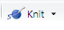
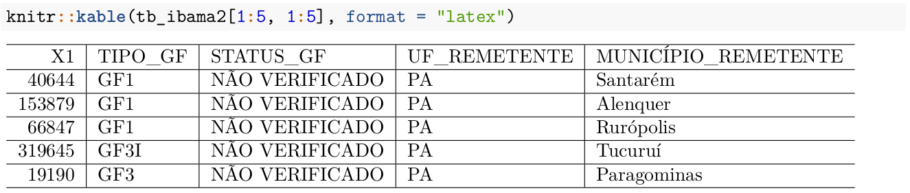

# Module IV {#m4}

## String Manipulation in R with `stringr`

### Introduction

The `stringr` package, as its name suggests, is a package for string manipulation and also for regular expressions. These two techniques are very important in data analysis, because we often deal with text snippets and character columns, where we need to find patterns of words, numbers, emails, phone numbers, names, etc.

All content related to the `stringr` package will be based on the package introduction page, available at [http://stringr.tidyverse.org](http://stringr.tidyverse.org). It will be like a selected and more user-friendly translation of the content provided by the authors. If you want to go deeper into the subject, you can refer to the book [**R for Data Science**](https://www.r4ds.co.nz) by Hadley Wickham.

There are four main families of functions in the `stringr` package:

* 1. character manipulation: these functions allow us to manipulate individual characters within strings and within vectors;

* 2. tools for dealing with whitespace, with which we can add, remove and manipulate whitespace;

* 3. locale-sensitive operations - these operations vary depending on location considering the alphabet used in each country;

* 4. pattern matching functions - these functions recognize 4 "engines" for describing patterns. The most common are regular expressions, which we will use in this course.

### Operations with individual characters

#### Getting and modifying characters

```{r}
# loading
library(stringr)
```

To get the length of a string use `str_length()`:
```{r}
str_length("abc")
```

To access individual characters (positions) or parts of a string, we can use `str_sub()`. This function takes as arguments a character vector, a start position and an end position. Both positions can receive a positive integer or a negative integer. If the position passed is a positive integer, the position count is made from left to right (from the beginning of the string) until the desired position is reached. When the position passed as argument is a negative integer, the count is made from right to left (from the end of the string) until the position is reached. In both cases the form of position evaluation is **inclusive**, that is, it includes the number that was passed. If the positions passed exceed the string limits, the result is truncated without returning any warning.

```{r}
x <- c("abcdef", "ghifjk")

# extracting 3rd letter
str_sub(x, 3, 3)
```

```{r}
# from second to second-to-last character
str_sub(x, 2, -2)
```

`str_sub()` can also be used to modify strings:

```{r}
str_sub(x, 3, 3) <- "X"
x
```

To duplicate individual strings, use `str_dup()`:

```{r}
str_dup(x, c(2, 3))
```

#### Whitespace

The following functions add, remove or modify existing whitespace in strings.

1. `str_pad()` fills a string with whitespace to a fixed width. Whitespace can be added to the left, right or both sides. This type of function is very useful for generating `.fwf` type files, i.e. with fixed widths/sizes for columns.

```{r}
x <- c("abc", "defghi")
str_pad(x, 10)
```

```{r}
str_pad(x, 10, "right")
```

```{r}
str_pad(x, 10, "both")
```

We can also fill the string with other elements instead of whitespace:
```{r}
str_pad(x, 10, "both", pad="@")
```

`str_pad()` never shortens a string:
```{r}
str_pad(x, 4)
```

Note: If you want to ensure that strings have the same size, combine `str_pad()` with `str_trunc()`:

```{r}
x <- c("Short", "This is a long string")

str_trunc(x, 10)

str_pad(x, 10)

# x %>% 
#   str_trunc(10) %>% 
#   str_pad(10, "right")
```

2. The opposite of `str_pad()` is `str_trim()`, which removes leading and trailing spaces:
```{r}
x <- c("  a   ", "b   ",  "   c")
str_trim(x)
```

```{r}
str_trim(x, "left")
```

3. We can use `str_wrap()` to modify existing whitespace to "wrap" for example a paragraph of text so that the length of each line is as similar as possible. It's like justifying the paragraph.
```{r}
blah_blah_blah <- str_c(
  "Roses are red, ",
  "Violets are blue, ",
  "... In any combination of words ",
  " str_wrap gives you a clue  "
)
# an alternative to c() for strings
```

```{r}
cat(str_wrap(blah_blah_blah, width = 40))
# cat is an alternative to print
```

#### Locale sensitive

A good part of `stringr` package functions are locale sensitive: they will behave differently depending on the country/region where the user is located.

See examples of functions that transform lowercase letters to uppercase and vice versa:

```{r}
x <- "I like horses."
str_to_upper(x)
```

```{r}
str_to_title(x)
```

```{r}
str_to_lower(x)
```

```{r}
# See the case of Turkish language which has two types of i: one with "dot" and another without
str_to_lower(x, "tr")
```

Sorting strings and their indices:

```{r}
x <- c("y", "i", "k")
str_order(x) # indices
```

```{r}
str_sort(x)
```

```{r}
# In Lithuanian language, y is between letters i and k
str_sort(x, locale = "lt")
```

An important aspect is that the default `stringr` configuration always comes with English language to ensure identical behavior in any system when using generic functions. This is different from what normally occurs with base R, where the global locale option normally varies with the regional version of the operating system and generates considerable confusion when developing programs.

To get a list of available abbreviations and regions, just run `stringi::stri_locale_list()`.

### Pattern matching

The vast majority of `stringr` functions work with patterns. These functions are parameterized by the type of task they perform and which patterns they match.

#### Tasks

Each matching function has the same first two arguments: a vector of strings to process and a pattern to match. The `stringr` package provides some functions to: detect `str_detect()`; locate `str_locate()`; extract `str_extract()`; match `str_match()`, replace `str_replace()`; and split strings `str_split()`.

Let's see an example with some strings and a Regular Expression to find US phone numbers:
```{r}
strings <- c(
  "apple", 
  "212 555 1234", 
  "212-555-8753", 
  "Work: 212-555-5835; Home: 646-555-5344"
)
phone <- "([0-9]{3})[- .]([0-9]{3})[- .]([0-9]{4})"
```

- `str_detect()` detects the presence or absence of a pattern and returns a logical vector.

- `str_subset()` returns the elements of a character vector that match a regular expression.

To know which positions of strings contain numbers, we can do:

```{r}
# Which strings contain numbers
str_detect(strings, phone)
```

```{r}
str_subset(strings, phone)
```

- `str_count()` counts the number of matches. To know how many phone numbers there are in each string, we can do:

```{r}
str_count(strings, phone)
```

- `str_locate()` locates the first position of the searched pattern in each string (element) present in the vector and returns a numeric **matrix** with columns indicating start and end positions.

- `str_locate_all()` locates all matches, returning a **list** of numeric matrices.

In which position of each string are the phone numbers located?

```{r}
(loc <- str_locate(strings, phone))
```

```{r}
str_locate_all(strings, phone)
```

- `str_extract()` extracts text corresponding to the **first match** within the string, returning a **character vector**.

- `str_extract_all()` extracts all matches and returns a **list** of character vectors.

```{r}
str_extract(strings, phone)
```

```{r}
str_extract_all(strings, phone)
```

Note that with `str_extract_all()`, we can identify exactly in which position of the original vector each string was.

```{r}
str_extract_all(strings, phone, simplify = TRUE)
```

- `str_match()` extracts capture groups from regular expressions formed by `()` only for the first match.

- `str_match_all()` extracts capture groups from all matches and returns a list of character matrices.

```{r}
# Pull out the three components of the match
str_match(strings, phone)
```

```{r}
str_match_all(strings, phone)
```

- `str_replace()` replaces the **first occurrence** where there was matching and returns a character vector.
- `str_replace_all()` replaces all matches.

This is a very interesting function to use when we're working with identified data and want to hide SSNs, phone numbers, etc. See an example with phone numbers.

```{r}
str_replace(strings, phone, "XXX-XXX-XXXX")
```

```{r}
str_replace_all(strings, phone, "XXX-XXX-XXXX")
```

- `str_split_fixed()` splits the string into a fixed number of parts based on the pattern passed as argument and returns a character **matrix**.

- `str_split()` separates a string into a variable number of parts and returns a **list** of character vectors.

```{r}
str_split("a-b-c", "-")
```

```{r}
str_split_fixed("a-b-c", "-", n = 2)
```

#### Indices and matching:

`str_subset()` allows extracting elements from a string vector, if it contains the character or group of characters informed.

```{r}
fruit <- c("apple", "banana", "pear", "pineapple")
str_subset(fruit, "a")
```

`str_which()` returns the position of the target vector, where a match was found for a certain character or set of characters informed.

```{r}
str_which(LETTERS, "F")
# str_which(LETTERS, "F|Y")
```

### Section References

- Wickham, H. (2019). _stringr: Simple, Consistent Wrappers for Common String Operations_. R package version 1.4.0. [https://CRAN.R-project.org/package=stringr](https://CRAN.R-project.org/package=stringr).

- ____. (2020). _stringr vignette: Introduction_. URL [http://stringr.tidyverse.org](http://stringr.tidyverse.org)

- Wickham, H.; Grolemund, G. (2016). _R for Data Science: Import, Tidy, Transform, Visualize, and Model Data_. O'Reilly Media. december 2016. 522 pages. Available at: [www.r4ds.co.nz](www.r4ds.co.nz)

***
***

## Regular Expressions (REGEX)

### Introduction

Programming languages have more than one type of pattern search mechanism in strings. Regular expressions are the most used mechanism. Therefore, it will be our focus in this course. However, know that the `stringr` package also brings implementations of the other 3 types, which we describe below:

- Fixed bytewise matching with the `fixed()` function;
- Locale-sensitive character matching with `coll()` (collation search);
- Text boundary analysis with the `boundary()` function.

If you're interested in the subject, you can seek more information in the `stringr` package documentation.

But what exactly would **Regular Expressions** be?

Regular Expressions are concise and flexible forms to describe patterns (that we're searching for) in strings. In this section, we'll describe the main aspects related to constructing regular expressions. For this we'll use some of the examples described in the `stringr` package [vignettes](http://stringr.tidyverse.org/articles/regular-expressions.html).

First we'll make a general introduction about regular expressions and then we'll see examples using the `stringr` package.

Why are **regular expressions** important?

Regular expressions allow us to describe in more general terms what we want to search in a string. Normally, it's more efficient to use regular expressions, because if we search for simple characters, we'll only get the exact match for that character. Have you thought about how we would search only for phone numbers, email addresses, SSNs or EINs in the middle of data (for example web pages) that are not exactly organized in columns?

It should be noted that regular expressions is a technique used practically throughout the programming world. It's not a particularity only of the **R** language.

Regular expressions (regex), in general, are constructed from the combination of 3 components:

* 1) literal characters: which will only match if there are identical literal characters in the data;

* 2) character classes: which allow matching by multiple characters - they are composed of characters inside two brackets `[ ]`;

* 3) modifiers or anchors: which will operate on characters, classes and combinations of both.

### REGEX Examples using `stringr`

#### Literal matches (basic match/literal characters)

The simplest pattern for matching is:

```{r}
x <- c("apple", "banana", "pear")
str_extract(x, "an")
```

We can ignore uppercase and lowercase letters with `ignore_case = TRUE`:

```{r}
bananas <- c("banana", "Banana", "BANANA")
str_detect(bananas, "banana")

str_detect(bananas, regex("banana", ignore_case = TRUE))
```

Continuing with the examples, the next step is to know the role played by `.`. Its function is to search for any character except a newline (`\n`):

```{r}
str_extract(x, ".a.")
```

But if you want to find even characters that indicate a newline, you can "set" `dotall = TRUE` inside the function responsible for the matching mechanism, which is the `regex()` function:

```{r}
str_detect("\nX\n", ".X.")
str_detect("\nX\n", regex(".X.", dotall = TRUE))
```

#### Escaping characters

If `.` matches any character, how can we do literal matching of a period "." in the data? We'll have to use an escape character to tell **R** that we want a **literal match** and not use the special behavior of `.`. In REGEX, a backslash `\` is used for this purpose.

So, to search for a simple "." in the data, we use `\.`. But there's a catch: the backslash is also treated as a special character in **R** when it comes to strings. Therefore, we would have to add another backslash forming the string `\\.` in order to match a simple period in the data.

```{r}
dot <- "\\."

# But see that as REGEX, there's only one backslash: \.
writeLines(dot)

# This tells R to explicitly search for a period
str_extract(c("abc", "a.c", "bef"), "a\\.c")
```

To help you understand how many backslashes you'll need to write in the code, let's think that there are two different mechanisms: the **R** interpreter and the REGEX mechanism. When you send a regular expression to the interpreter, it will pass through a filter where **R** rules will be applied. After this first filter, the expression goes to a new instance, where the REGEX mechanism will act.

Think of these steps as a toll booth. For each backslash that needs to reach the last toll stage, you also need a backslash `\` to "pay the toll" of the first stage. Backslashes `\` are therefore your currency and you can't carry more or less "money" than you need. If the expression has to arrive at the REGEX stage as `\.`, so that the last backslash is seen as a special character that de-characterizes the special functioning of `.`, thus making a literal match, you need to send one more backslash `\` to be consumed at the **R** interpreter stage. That's why, in your code, you should write `\\.`.

Have you thought, then, how we would do literal matching of a backslash in a string?

Let's think again as a toll booth, starting from the last stage to the first. In the REGEX mechanism, last toll stage, the expression must arrive with two backslashes `\\`: the left one acting as a special character, which eliminates the special function of the right backslash. Therefore, to carry two backslashes to the end of the process, you need two other backslashes `\\` to be consumed at the **R** interpreter stage. Therefore, to do literal matching of a backslash in a string, your code should be written as `\\\\`.

What happens, in fact, is that the interpreter separates each pair of backslashes, making the left one remove the special functioning of the right backslash in each pair. Thus, only two backslashes arrive at the REGEX mechanism.

```{r}
x <- "a\\b"
writeLines(x)
```

```{r}
str_extract(x, "\\\\")
```

From now on, when we refer to regular expressions, we'll use the form with only one `\`. However, know that in your code in **R** functions, you should add one more backslash `\\`.

#### Matching multiple characters (classes)

First, we'll see some shortcuts for character classes:

```{r, echo = FALSE}
df<-data.frame("shortcuts"=c("\\\\w","\\\\W","\\\\d","\\\\D","\\\\s","\\\\S"),
               "classes"=c("alphanumeric and _ (any word)",
                           "non-alphanumeric (anything different from words and _)",
                           "digits",
                           "non-digits",
                           "space",
                           "non-space"))
knitr::kable(df)
```

Let's move on to examples:

```{r}
str_extract_all("Don't eat that!", "\\w+")[[1]]

str_split("Don't eat that!", "\\W")[[1]]
```

```{r}
str_extract_all("1 + 2 = 3", "\\d+")[[1]]
```

```{r}
(text <- "Text  \t with\n\t\tbad spacing \f")
str_replace_all(text, "\\s+", " ")
```

Another interesting shortcut is `\b` which searches for word boundaries/borders, i.e., transitions between word characters and non-word characters. `\B` does the opposite.

```{r}
str_replace_all("The quick brown fox", "\\b", "_")

str_replace_all("The quick brown fox", "\\B", "_")
```

You can consult other interesting shortcuts in this `stringr` package [vignette](http://stringr.tidyverse.org/articles/regular-expressions.html).

There's also the possibility of creating our own classes using `[]`:

* `[abc]`: matches a, b or c;
* `[a-z]`: matches any lowercase character between **a** and **z**;
* `[A-Z]`: matches any uppercase character between **A** and **Z**;
* `[^abc]`: matches anything except **a**, **b**, or **c**;
* `[\^\-]`: matches `^` or `-`. Remember to add one more backslash in front of each backslash when passing the command in **R**

There are also several pre-built classes we can use with brackets:

* `[:punct:]`: punctuation;
* `[:alpha:]`: letters;
* `[:lower:]`: lowercase letters;
* `[:upper:]`: UPPERCASE LETTERS;
* `[:digit:]`: digits;
* `[:alnum:]`: letters and numbers.
* `[:cntrl:]`: control characters.
* `[:graph:]`: letters, numbers and punctuation.
* `[:print:]`: letters, numbers, punctuation and whitespace.
* `[:space:]`: space characters (equivalent to `\s`).
* `[:blank:]`: space and tab.

These expressions go inside other brackets:

```{r}
y <- c(1234, "R", "UNF", " ", "Hello, how are you?")
str_extract_all(y, "[[:digit:]]")

str_extract_all(y, "[[:digit:]a]")

str_extract_all(y, "[[:digit:]hw]")

str_extract_all(y, "[y[:upper:]w]")
```

#### Alternation Operator

`|` is the alternation operator that allows choosing between one or more possible matches. `abc|def` will match `abc` or `def`.

```{r}
str_detect(c("abc", "def", "ghi"), "abc|def")
```

#### Grouping

Parentheses can serve to alter precedence rules or form groups. The same thing we saw in Module \@ref(m1) to alter precedence rules applies to REGEX:

```{r}
str_extract(c("grey", "gray"), "gre|ay")

str_extract(c("grey", "gray"), "gr(e|a)y")
```

Parentheses define groups and we can backreference these groups using `\group_number` to indicate that groups can repeat more times, as well as the order in which they would repeat in the string.

```{r}
pattern <- "(1|2)(3|4)\\1"

combinations <- list("1213", "1413", "2324", "1111", "2222", "1415", "1313", "1331")

combinations %>%
  str_subset(pattern)

pattern2 <- "(1|2)(3|4)\\1\\2"

combinations %>%
  str_subset(pattern2)

pattern3 <- "(1|2)(3|4)\\2\\1"

combinations %>%
  str_subset(pattern3)
```

#### Anchors or modifiers

Anchoring means establishing a pattern for the beginning or end of the string we're searching for.

* `^` searches for the pattern at the beginning of the string;
* `$` searches for the pattern at the end of the string.

```{r}
x <- c("apple", "banana", "pear")
str_extract(x, "^a")

str_extract(x, "a$")
```

#### Repetitions

We can control how many times a pattern appears in a certain part of the string with:

* `?`: 0 or 1.
* `+`: 1 or more.
* `*`: 0 or more.

```{r}
x <- "1888 is the longest year in Roman numerals: MDCCCLXXXVIII"
str_extract(x, "CC?")

str_extract(x, "CC+")

str_extract(x, 'C[LX]+')

str_match("banana", '(na)+')
```

We can specify the exact number of repetitions we expect with:

* `{n}`: exactly $n$ times;
* `{n,}`: $n$ times or more;
* `{n,m}`: between $n$ and $m$ times.

```{r}
str_extract(x, "C{2}")

str_extract(x, "C{2,}")

str_extract(x, "C{2,3}")
```

There are several other patterns and expressions that can be used. Search `??stringi_search-regex` or visit the `stringr` website.

***

### Section References

- Wickham, H. (2019). _stringr: Simple, Consistent Wrappers for Common String Operations_. R package version 1.4.0. [https://CRAN.R-project.org/package=stringr](https://CRAN.R-project.org/package=stringr).

- ____. (2020). _stringr vignette: Introduction_. URL [http://stringr.tidyverse.org](http://stringr.tidyverse.org)

- Wickham, H.; Grolemund, G. (2016). _R for Data Science: Import, Tidy, Transform, Visualize, and Model Data_. O'Reilly Media. december 2016. 522 pages. Available at: [www.r4ds.co.nz](www.r4ds.co.nz)

***
***

## Reports and Reproducible Research with `rmarkdown`

### Introduction

We've reached a point in the course where we already have powerful tools to analyze and process data. However, nowadays, there's another stage as important as the previous ones in Data Science: sharing and communicating your analyses.

For this purpose, **R** is certainly the most powerful tool nowadays: you can integrate from the data analysis stage to sharing your codes, graphs and findings through reports, slides, $\TeX$ articles and even books. This course material itself was all made within the **R** language.

In this section, we'll focus on report production. We'll also see how to make these reports adapt automatically to changes in the data that originate your analysis. In addition to this practical issue, all data and codes used in an analysis can be shared with your team, which reinforces the reproducibility character of the **R** language. Anyone else can easily replicate and verify/validate the results obtained by you.

The tool that allows us to do most of these things we mentioned above is the `rmarkdown` package. It's a package that gravitates around the `tidyverse` core. `rmarkdown` unites text writing and code writing in a single place, through markdown markup language. The markup language has a quite simple syntax that makes text production very agile, unlike what occurs with $HTML$ and $\LaTeX$, for example. This means you don't need to leave RStudio or even switch windows or tabs to include text, figures, outputs or code chunks in an R Markdown document. The `rmarkdown` package is so surprising that from it emerged derivative packages that allow creating websites and blogs with `blogdown` and making books and course materials like this one you're reading through the `bookdown` package, among others.

To start making a report in R Markdown, you need to create a new `.Rmd` file. Click on , as you normally do to create a script, only this time select "R Markdown" .

A new window will open in RStudio, where you should choose what type of output file you want, whether `HTML`, `PDF` or `.docx`, as well as its name and your report title. Let's choose `PDF`.


Note that a new tab is automatically created in RStudio, with a pre-formatted `.Rmd` report template.

**ATTENTION:** If this is your first time using R Markdown on Windows, RStudio itself will offer to install some necessary packages (and their dependencies) to run `rmarkdown`. Among them will be the `tinytex` package. This is a package that performs the minimal installation of $\LaTeX$ libraries necessary for generating `.pdf` documents from R Markdown. After installing the packages, just run the code below in the console and then restart your RStudio session.

```{r, eval=FALSE}
tinytex::install_tinytex()
```

In the created tab, there's all the data you informed previously and also a series of automatically created examples depicting the functioning of a simple R Markdown report. Note that all text is editable.


Documents are generated using the `knitr` package. This package functions as a support package for `rmarkdown`, but you don't need to know it in depth. Knit in English means to knit or unite. And that's exactly what it does, it stitches and unites all elements that you come to build or program with R Markdown. If you already want to generate a report from the example presented to you when creating a new `.Rmd` file, you can do so by clicking the Knit button  in the RStudio window. After choosing a name and saving your `.Rmd` file, if you chose the `PDF` option, you'll have a `.pdf` extension file. Test changing the destination files: `.html` and `.docx` directly in the `Knit` button.

**TIP:** For each new command you learn throughout this section, we suggest generating a new report, so you can follow the modifications made in the document. Therefore, we also suggest you delete all content from the suggestion report created when opening a new `.Rmd` document, keeping only the header data: `title`, `author`, `date` and `output`.

### Header

In the header you can specify all technical aspects of your text formatting in R Markdown. There are several options, but we'll focus on the most basic ones that appear on the screen at this moment.

* `title` contains your document title;
* `author` your name;
* `date` the document generation date;
* `output` the type of document to be generated, whether HTML, PDF or Word.

**Some useful tricks:**

* If you want to add a co-author, use:
```{rmarkdown}
author:
  - Author1 Name
  - Author2 Name
```

* To add a subtitle, just write:
```{rmarkdown}
title: "Your Title"
subtitle: "Subtitle for the report"
```

* So you don't have to manually change the date every time you run Knit, use the `format()` function together with `Sys.time()`. Note that this code is passed between backticks ` `` `.

```{rmarkdown}
date: "`r format(Sys.time(), '%B %d, %Y')`"
```

### Text Formatting

R Markdown's text formatting syntax is very simple. That's why text production with it is very fast. This comes at the cost of not having as much flexibility in altering textual elements as in a language like $\LaTeX$, but still, the formatting possibilities are quite considerable.

#### Titles

The `#` symbol is used to define titles. For each `#` added, you descend one hierarchy and create a subtitle of the previous title. The fewer `#` there are before your title, the greater the hierarchy and consequently the larger the font.

```{rmarkdown}
# Article Title
## Subtitle
### Section
#### Subsection
```

#### Paragraphs

To write a paragraph just start writing any text. To add paragraphs just skip a line, leaving a blank space between paragraphs

```{rmarkdown}
This is the first paragraph of your text. You can write normally and it 
will appear in your report.

After skipping a line, you start a new paragraph. Add the ideas you 
want in this second paragraph
```

#### Font formatting

You can apply italic and bold formatting to specific words, expressions or complete excerpts of your text, placing the word or excerpt in question between asterisks.

For bold formatting, use `**word or excerpt**`: **word or excerpt**.

For italic formatting, use `*word or excerpt*`: *word or excerpt*.

You can get the same effect using underscore instead of asterisks, as in these examples `_word or excerpt_`: _word or excerpt_; and `__word or excerpt__`: __word or excerpt__.

#### Footnotes

Footnotes can be inserted in the text using the scheme `word^[Text that will go to the footnote about the word.]`

```{rmarkdown}
In this text we're going to insert a footnote about the word Statistics^[Statistics 
is the discipline that consists of collecting, organizing, analyzing and presenting data.]
```

#### Making lists and item enumeration

##### Unnumbered lists

To create **unnumbered** lists, we can use either `*` or `-`:

```{rmarkdown}
* item X
* item Y
* item Z
```

* item X
* item Y
* item Z

```{rmarkdown}
- item X
- item Y
- item Z
```

- item X
- item Y
- item Z

In unnumbered lists, to create subitems, you must give 4 spaces or `TAB` from the left margin and use `-` or `+`:

```{rmarkdown}
* item X
  - subitem
* item Y
  - subitem
    + subsubitem
* item Z
  + subitem
  + subitem
```

* item X
  - subitem
* item Y
  - subitem
    + subsubitem
- item Z
  + subitem
  + subitem

##### Numbered lists

To create **numbered** lists, we use the numeral accompanied by a period: `1.`, `2.`, `3.` and so on. For creating subitems, in case of numbered lists, use **two** `TAB` or 4 spaces followed by `-`.

```{rmarkdown}
1. item A
    - subitem
2. item B
    - subitem
    - subitem
2. item C
    - subitem
    - subitem
```

1. item A
    - subitem
2. item B
    - subitem
    - subitem
2. item C
    - subitem
    - subitem

#### Tables

Tables can be added using `|` to separate columns and `------` to separate the header, containing column names. Note that the straight bars that separate columns must be aligned.

```{rmarkdown}
column1 | column2  | column3
--------|----------|--------
Name1   | Address1 | Value1
Name2   | Address2 | Value2
Name3   | Address3 | Value3
```

column1 | column2  | column3
--------|----------|--------
Name1   | Address1 | Value1
Name2   | Address2 | Value2
Name3   | Address3 | Value3

### Inserting external figures

You can include in your report external figures, that is, figures that are not generated from **R**. You can reference both figures that are stored locally on your machine and figures available on the web.

```{rmarkdown}


```


### Inserting links

The process of inserting links follows a very similar approach to inserting external figures. The difference is that you won't need `!` anymore. Also, only the text inside brackets `[]` will appear to the reader. When clicked, they will be directed to the link to be passed inside parentheses `()`.

```{rmarkdown}
Click on this [LINK](https://www.unf.edu).

File available at [https://www.unf.edu](https://www.unf.edu).
```

Click on this [LINK](https://www.unf.edu).

File available at [https://www.unf.edu](https://www.unf.edu).

### Mathematical formulas

You can insert mathematical formulas using $\LaTeX$ principles. See the probability density function of a Normal distribution. For this, you must pass the formula between double `$$`. Note how elegant the formatting is.

```{rmarkdown}
$$
f(x;\mu,\sigma^2) = \frac{1}{\sigma\sqrt{2\pi}}
e^{ -\frac{1}{2}\left(\frac{x-\mu}{\sigma}\right)^2 }
$$
```

$$
f(x;\mu,\sigma^2) = \frac{1}{\sigma\sqrt{2\pi}}
e^{ -\frac{1}{2}\left(\frac{x-\mu}{\sigma}\right)^2 }
$$

If you want to present some formula in the middle of a paragraph text, pass the formula only between two simple `$`:

```{rmarkdown}
The probability density function of the Normal Distribution is given by $f(x;\mu,\sigma^2) =
\frac{1}{\sigma\sqrt{2\pi}} e^{ -\frac{1}{2}\left(\frac{x-\mu}{\sigma}\right)^2 }$.
```

The probability density function of the Normal Distribution is given by $f(x;\mu,\sigma^2) = \frac{1}{\sigma\sqrt{2\pi}} e^{ -\frac{1}{2}\left(\frac{x-\mu}{\sigma}\right)^2 }$.

### Code insertion and execution

The biggest advantage of R Markdown is probably the possibility of joining code, outputs and text all in the same place in a very simple and natural way.

#### Simple insertion

To present your code along a line, without necessarily executing it, use simple backticks.

```{rmarkdown}
In R, we can create a numeric vector x through the code `x <- c(1:10)`.
```

In R, we can create a numeric vector x through the code `x <- c(1:10)`.

If we need to present a larger piece of code, we can do it between triple backticks ` ``` `, forming a block:

````rmarkdown

This is a larger piece of code:

```
x <- c(1:10)
sum(x)
```

````

Which results in:

This is a larger piece of code:

```
x <- c(1:10)
sum(x)
```

#### Insertions with execution and other controls

To start presenting your codes together with respective outputs (which include graphs), we use what we call chunks, which are nothing more than pieces of code to be executed during document processing. `rmarkdown` and its interaction with RStudio are so sophisticated that, if you have other languages installed on your machine, you can even change the R language display format to Python for example. However, our focus will be only on configuring the most used parameters.

Initially, to create an **R** code chunk, you must use the same triple backticks ` ``` ` from the previous example, accompanied by the notation `{r}`. Don't forget to close the chunk with the same triple quotes.

````markdown
`r ''````{r}
x <- 1:10
sum(x)
```
````

As a result, we now have the printing of the output of the previous code:

```{r}
x <- 1:10
sum(x)
```

**TIP:** It's also possible to execute code snippets inline, in the middle of paragraphs. For this, we use ``` `r
sum(x)`
```
For example: ``` The sum of vector x is ``` ``` `r
sum(x)`.
```

Which results in:

The sum of vector x is `r sum(x)`.

##### Main chunk options

The main chunk options are:

* `results`: specifies how, and if, chunk results will be shown;
    - options:
        - `markup` (default): displays results normally
        - `hide`: doesn't display outputs in final report
        - `hold`: displays results only at end of report
        - `asis`: doesn't reformat results, displaying (useful when outputs are HTML code, for example)

* `echo`: specifies if chunk code will be displayed
    - options:
        - `TRUE` (default): displays codes above output
        - `FALSE`: displays only output generated by chunk
        
* `eval`: specifies if chunk will be executed or not
    - options:
        - `TRUE` (default): executes chunk
        - `FALSE`: doesn't execute chunk (useful when we want to display only codes and not their output)

* `message` and `warning`: defines if messages and other warnings generated during code execution
    - options:
        - `TRUE` (default): displays messages and warnings generated during chunk execution
        - `FALSE`: suppresses display of messages and warnings (useful to suppress package loading messages)

* `fig.cap`: specifies a description for figure generated in chunk

* `fig.align`: defines alignment of figure generated in chunk
    - options:
        - `center` (default): alignment at document center
        - `left`: left alignment
        - `right`: right alignment
        
* `fig.height` and `fig.width`: defines figure height and width in inches
        - default is size 7

If nothing is specified for a certain option, default configurations are used in code evaluation and results display.

These options must be passed in chunk headers, next to the letter `r` and inside braces `{}`, for example:

````markdown
`r ''````{r, echo=FALSE, message=FALSE}
library(dplyr)

x <- 1:10

x %>%
  sum()
  
```
````

You can also assign names to your chunks. This is highly recommended when producing relatively large reports with several chunks, as it will facilitate identification of eventual errors during document generation process. Names must be informed before the first comma, at a space distance from letter r: `{r chunk_name, options}`

Let's see some examples, where we create some named chunks, to read one of the databases from previous modules and plot a graph using `ggplot2`:

````markdown
`r ''````{r loading, message=FALSE}

library(readr)
library(dplyr)
library(nycflights13)

# Loading flights data
flights_data <- flights

# Creating summary by carrier
carrier_summary <- flights_data %>%
  group_by(carrier) %>%
  summarise(
    total_flights = n(),
    avg_delay = mean(dep_delay, na.rm = TRUE),
    avg_distance = mean(distance, na.rm = TRUE)
  ) %>%
  arrange(desc(total_flights))
```
````

````markdown
`r ''````{r plot, fig.cap="Source: nycflights13 package", fig.height=5, fig.width=7, fig.align="center"}

library(ggplot2)

carrier_summary %>%
  ggplot(aes(x = reorder(carrier, -total_flights), y = total_flights)) +
  geom_col(fill = "steelblue") +
  labs(title = "Total Flights by Carrier",
       x = "Carrier",
       y = "Number of Flights") +
  theme_minimal() +
  theme(axis.text.x = element_text(angle = 45, hjust = 1))
```
````

Which would result in:

```{r loading, message=FALSE}
library(readr)
library(dplyr)
library(nycflights13)

# Loading flights data
flights_data <- flights

# Creating summary by carrier
carrier_summary <- flights_data %>%
  group_by(carrier) %>%
  summarise(
    total_flights = n(),
    avg_delay = mean(dep_delay, na.rm = TRUE),
    avg_distance = mean(distance, na.rm = TRUE)
  ) %>%
  arrange(desc(total_flights))
```

```{r plot, fig.cap="Source: nycflights13 package", fig.height=5, fig.width=7, fig.align="center"}
library(ggplot2)

carrier_summary %>%
  ggplot(aes(x = reorder(carrier, -total_flights), y = total_flights)) +
  geom_col(fill = "steelblue") +
  labs(title = "Total Flights by Carrier",
       x = "Carrier",
       y = "Number of Flights") +
  theme_minimal() +
  theme(axis.text.x = element_text(angle = 45, hjust = 1))
```

### More sophisticated tables

When we use a tibble or data frame and the destination output is an HTML file, we benefit from the fact that R Markdown recognizes the format and prints the tibble or data frame content as an R Markdown table. For this just include the following lines in the YAML header, changing <option> to `paged`, `kable` or `tibble`. Let's see an example with paged

```{rmarkdown}
---
title: "Title"
output:
  html_document:
    df_print: <option>
---
```

Let's use the `df_print: paged` option, which will make the table printed in a paginated way, displaying only a few lines (and columns) at a time and allowing users to navigate through its content interactively. After changing the header, just call the `carrier_summary` object from within a chunk.

````markdown
`r ''````{r table, cols.print = 5, rows.print = 5}

carrier_summary
```
````

Note that the `cols.print` and `rows.print` arguments control the number of columns and rows to be displayed in each pagination.

The result will be the following:


**TIP:** If you want to better control table outputs, or seek to generate more sophisticated tables in PDF or Word reports, we can use the `knitr::kable` function inside an R Markdown chunk.

```{r, eval = FALSE}
knitr::kable(carrier_summary[1:5, 1:4], format = "latex")
```

In the code above, we present an extract of data (first 5 rows and first 4 columns) from the data frame named `carrier_summary` that we used throughout the course. The `format = latex` option is suitable for producing tables in $\LaTeX$ style.



If the goal is to make the table look even better you can use the `booktabs = TRUE` option, which makes the pandoc engine use the $\LaTeX$ booktabs package to generate the table. There are several other options to further improve table style, such as adding footnotes, titles, colors, etc. For this you should investigate other options of the `kable` function itself and the `kableExtra` package that expands customization possibilities.

***

### Section References

- Allaire, J. J.; Xie, Y.; McPherson, J.; Luraschi, J.; Ushey, K.; Atkins, A.; Wickham, H.; Cheng, J.; Chang, W.; Iannone, R. (2019). _rmarkdown: Dynamic Documents for R_. R package version 1.13. URL [https://rmarkdown.rstudio.com](https://rmarkdown.rstudio.com).

- Xie, Y. (2019). _R Markdown Cookbook_. CRS Press. Available at: [https://bookdown.org/yihui/rmarkdown-cookbook/](https://bookdown.org/yihui/rmarkdown-cookbook/)

- Xie Y.; Allaire, J. J.; Grolemund, G. (2018). _R Markdown: The Definitive Guide_. Boca Raton, Florida: Chapman; Hall/CRC. Available at: [https://bookdown.org/yihui/rmarkdown](https://bookdown.org/yihui/rmarkdown).

- _R MARKDOWN REFERENCE GUIDE_. Available at: [https://rstudio.com/wp-content/uploads/2015/03/rmarkdown-reference.pdf](https://rstudio.com/wp-content/uploads/2015/03/rmarkdown-reference.pdf).

### Exercises

1) Choose a report you worked on recently and try to reproduce all of it or just a section using R Markdown knowledge. Give preference to works that involve data that allow applying most of the techniques seen throughout the course.

2) Create a simple R Markdown report about a topic of your choice (could be about Jacksonville, UNF, your major, etc.) that includes:
   - At least 3 different heading levels
   - Bold and italic text
   - A numbered list and an unnumbered list
   - A table
   - An external image or link
   - A mathematical formula
   - At least 2 code chunks with different options

3) Practice with the `nycflights13` dataset:
   - Create an R Markdown document that analyzes flight delays
   - Include at least one table and one plot
   - Use inline R code to report summary statistics
   - Export to both HTML and PDF formats
