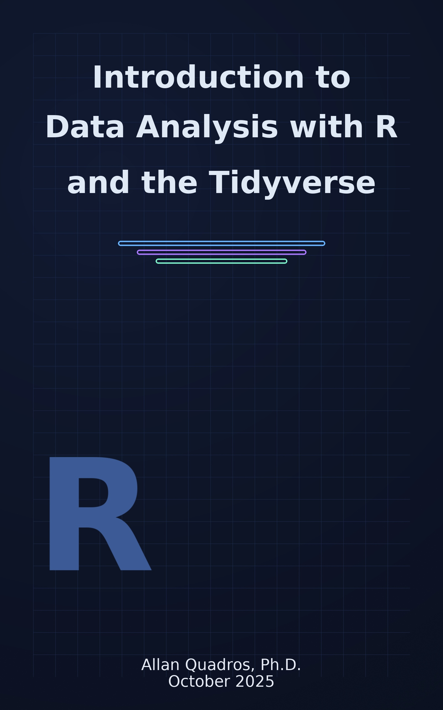

--- 
title: "Introduction to Data Analysis with R and the Tidyverse"
author: "Allan Quadros, Ph.D."
date: "October 2025 | Revision February 2026"
cover-image: img/cover_dark_v2.jpg
apple-touch-icon: img/apple-touch-icon.png
favicon: img/favicon.ico
url: 'https://allanvc.github.io/book_IDART_en'
site: bookdown::bookdown_site
output: 
  bookdown::gitbook:
    config:
      edit : null
      download: null
      search: yes
      sharing:
       facebook: yes
       github: yes
       twitter: yes
       linkedin: yes
       weibo: no
       instapaper: no
       vk: no
      fontsettings:
        #theme: sepia
documentclass: book
# bibliography: [book.bib, packages.bib]
# biblio-style: apalike
# link-citations: no
github-repo: allanvc/book_IDART_en
description: "Textbook accompanying the Introductory Course on Data Analysis in R using Tidyverse."
---

# Welcome! {-}



This is the repository for the textbook of the *Introduction to Data Analysis in R using Tidyverse* course. To reproduce the code present in the book, you need a recent version of [R](https://cran.r-project.org/) and updated packages. At the beginning of each section, you will be introduced to the packages needed to execute the code related to that topic.

It is highly recommended to use the most recent version of the Integrated Development Environment (IDE) [__RStudio__](https://posit.co/downloads/).

Bugs and typos found in this book can be reported in the its _Git_ repository: https://github.com/allanvc/book_IDART_en/issues/
<div style="clear: both;"></div>


## Why R? {-}

The **R** programming language is known for having a relatively slow learning curve, but once students understand the basic structure of objects that make up the language, learning becomes exponential.

```{r nice-fig, echo=FALSE, fig.cap='**R** Learning Curve', out.width='50%', fig.asp=.75, fig.align='center'}
par(mar = c(4, 4, .1, .1))
plot(pressure, type = 'b', pch = 19, xlab = "time", ylab = "learning", axes = FALSE)
```

**R** is relatively different from other programming languages because it was _developed by Statisticians for Statisticians_. It wasn't designed to be the most efficient language in terms of speed, but rather to make the lives of those who analyze data easier. My experience with other programming languages leads me to affirm that this is true: there is no language more suitable for data analysis than **R**. Individual preferences and other conveniences may lead to choosing one language or another, but there's no denying the fact that **R** has the best tools for *Data Wrangling* (data preparation), graph generation, report generation, and reproducibility.

Furthermore, **R** is globally recognized for its extremely active and inclusive community. It is the preferred language in academia, given that new mathematical, statistical, and/or computational techniques are implemented first in **R**. It is also one of the most used languages in industry for Data Science, along with Python.

For these reasons and for being an _open source_ language, endowed with a powerful package management environment, the dissemination of **R** use in its 20 years of history has been extremely rapid and has relegated data analysis environments and languages like SAS, SPSS, and Stata to second place. In **R**, you'll find packages for the most diverse purposes: from packages that generate exams from a question bank, through data preparation packages, mathematical optimization, Machine Learning, to packages for audio analysis, application creation, reading and sending emails.

Today, there are several environments and languages used for Data Analysis, such as Python, Julia, Scala, SAS, etc. However, none of them provide the combination of an excellent package management ecosystem, statistical capabilities, visualization options, and a powerful IDE (Integrated Development Environment) - all implemented by the **R** community. For all these characteristics, the benefits of learning the **R** language are truly considerable.

## Course Organization {-}

This course is divided into 4 Modules. Module \@ref(m1) seeks to familiarize students with the basic concepts of the language, covering history, basic functionalities, and the structure of the most important objects in R.

Modules \@ref(m2) and \@ref(m3) are always divided into 3 parts: data reading, data manipulation, and visualization. With each Module, new packages are presented for these functionalities, with a slightly deeper level of specialization compared to the previous module.

Module \@ref(m4) begins with a focus on string manipulation and regular expressions (REGEX) and ends by presenting report production techniques and reproducibility in **R**.

## About the Author {-}


**Allan Quadros** is an Instructor of Information Systems and Operations Management at the University of North Florida (UNF), where he teaches data and business analytics in the Coggin College of Business. He earned a Ph.D. in Statistics from Kansas State University (2025), an M.Sc. in Economic Development from the State University of Campinas (UNICAMP, 2012), and a B.Sc. in Statistics from the University of Brasília (UnB, 2018).

Allan is the author of several **R** packages, including [emstreeR](https://www.github.com/allanvc/emstreeR), [mRpostman](https://allanvc.github.io/mRpostman)—recognized by RStudio’s R Views Blog as one of the top 40 new CRAN packages in August 2019—and [onlineretail](https://www.github.com/allanvc/onlineretail). His work spans computational statistics, Bayesian statistics, financial econometrics, and data-driven applications in business and finance.

Among his professional experience, selected highlights include serving as Lead Data Scientist at Brazil’s National Fund for Educational Development (FNDE) and developing an equipment-failure risk model for the USDA’s National Bio and Agro-Defense Facility (NBAF).

He has published peer-reviewed research and presented at international conferences. His teaching has been recognized with multiple honors, including the William L. Stamey Award for Excellence in Teaching (Kansas State University College of Arts and Sciences, 2023), the Graduate Student Council Award for Graduate Student Teaching Excellence (2024), and a nomination for the Midwestern Association of Graduate Schools’ Excellence in Teaching Award (2025).


More information can be found at: [https://allanvc.github.io](https://allanvc.github.io)
<div style="clear: both;"></div>

---

**Contact Information:**
- Email: allan.quadros[at]unf.edu
- Office: Coggin College of Business, Building 42, Office 1110
- University of North Florida, 1 UNF Drive, Jacksonville, FL 32224
